<!--
  Challa Abhiram — GitHub profile README
  The hero is a hand-built animated SVG (assets/hero.svg), not an image service.
-->

<p align="center">
  
</p>

<p align="center">
  <a href="https://www.linkedin.com/in/abhi-ram-9003b9299">
    
  </a>
  <a href="mailto:mr.abhiram5826@gmail.com">
    
  </a>
  <a href="https://github.com/Abhi-420bytes?tab=repositories">
    
  </a>
</p>

<p align="center">
  
  
  
  
</p>


<p align="center">
  <a href="https://github.com/Abhi-420bytes">
    
  </a>
</p>

## `~/whoami`

```yaml
name:      Challa Abhiram
education: B.Tech, Computer Science & Engineering
           Amrita Vishwa Vidyapeetham, Bengaluru  (2023 – 2027)
worked_as: Data Scientist Intern @ AiSPRY
builds:    full-stack platforms · ML pipelines · automation workflows
learning:  [ System Design, AWS Cloud Architecture, DevOps, Advanced ML ]
ask_me_about:
  - turning a messy dataset into a model that actually ships
  - wiring a Next.js frontend to a Django/Node backend without tears
  - automating anything twice-done with n8n
motto:     "ship it, measure it, then make it fast"
```

<details>
<summary><b>🎯 A bit more, if you're curious</b></summary>

<br>

I like the two ends of the stack that most people treat as separate worlds — the **product surface** people actually
touch, and the **model or pipeline** quietly making it smart underneath. Most of what's pinned below is me trying to
close that gap: a business platform with real role-based access, a traffic simulator that reasons about lanes, a
protein-structure tool, a scheduler that chases greener compute.

**Right now:** grinding System Design and AWS, and open to **SDE / ML internship** opportunities.
The fastest way to reach me is [email](mailto:mr.abhiram5826@gmail.com) or [LinkedIn](https://www.linkedin.com/in/abhi-ram-9003b9299).

</details>


## `~/stack --list`

<p align="center"><b>Languages</b></p>
<p align="center">
  
</p>

<p align="center"><b>Frontend</b></p>
<p align="center">
  
</p>

<p align="center"><b>Backend</b></p>
<p align="center">
  
</p>

<p align="center"><b>Databases</b></p>
<p align="center">
  
</p>

<p align="center"><b>Cloud &amp; Tooling</b></p>
<p align="center">
  
  <br/>
  
</p>

<details>
<summary><b>📦 The same list, as badges</b></summary>

<br>

**Languages** &nbsp;


**Frontend** &nbsp;


**Backend** &nbsp;


**Databases** &nbsp;


**Tools** &nbsp;


</details>


## `~/experience.log`

```console
$ tail -f experience.log

[ Nov 2025 → Jan 2026 ]  AiSPRY  ·  Data Scientist Intern
  ├─ cleaned, preprocessed and feature-engineered raw datasets
  ├─ built end-to-end machine learning workflows
  ├─ automated recurring data pipelines with n8n
  └─ evaluated models on precision · recall · accuracy · F1
```


## `~/projects --featured`

<table>
  <tr>
    <td width="50%" valign="top">
      <h3>🏢 <a href="https://github.com/Abhi-420bytes/srivari-project">Sri Vari Water Solutions</a></h3>
      <p>A full-stack business management platform — role-based authentication, inventory, payroll, a customer portal, real-time notifications and analytics dashboards.</p>
      <p>
        
        
        
      </p>
    </td>
    <td width="50%" valign="top">
      <h3>🧬 <a href="https://github.com/Abhi-420bytes/protein-ai-structural-intelligence">Protein AI Structural Intelligence</a></h3>
      <p>Machine learning applied to protein structure — the model, the pipeline and the interface around it.</p>
      <p>
        
        
        
      </p>
    </td>
  </tr>
  <tr>
    <td width="50%" valign="top">
      <h3>🌱 <a href="https://github.com/Abhi-420bytes/adaptive-green-datacenter-scheduler">Adaptive Green Datacenter Scheduler</a></h3>
      <p>Scheduling workloads adaptively so a datacenter burns less energy doing the same work.</p>
      <p>
        
        
        
      </p>
    </td>
    <td width="50%" valign="top">
      <h3>🔊 <a href="https://github.com/Abhi-420bytes/voice-biometric-authentication">Voice Biometric Authentication</a></h3>
      <p>Verifying identity from a voiceprint — signal processing meeting classification.</p>
      <p>
        
        
        
      </p>
    </td>
  </tr>
  <tr>
    <td width="50%" valign="top">
      <h3>⚖️ <a href="https://github.com/Abhi-420bytes/legal-document-analysis-system">Legal Document Analysis System</a></h3>
      <p>Natural-language processing turned on dense legal documents to pull out what matters.</p>
      <p>
        
        
        
      </p>
    </td>
    <td width="50%" valign="top">
      <h3>👁️ <a href="https://github.com/Abhi-420bytes/retinal-disease-classification">Retinal Disease Classification</a></h3>
      <p>Medical image classification — spotting retinal disease from scans.</p>
      <p>
        
        
        
      </p>
    </td>
  </tr>
</table>

> **🚦 AI Driven Traffic Simulation** — traffic simulation with dynamic lane partitioning to ease congestion and
> optimise flow. &nbsp;•&nbsp; **💼 Opportunity Quest** — career-exploration platform with secure auth, job APIs
> and an intelligent discovery dashboard.

<details>
<summary><b>🗂️ Every repository, in one table</b></summary>

<br>

| Repository | What it is |
|---|---|
| [srivari-project](https://github.com/Abhi-420bytes/srivari-project) | Full-stack business management platform |
| [adaptive-green-datacenter-scheduler](https://github.com/Abhi-420bytes/adaptive-green-datacenter-scheduler) | Energy-aware workload scheduling |
| [protein-ai-structural-intelligence](https://github.com/Abhi-420bytes/protein-ai-structural-intelligence) | ML on protein structures |
| [voice-biometric-authentication](https://github.com/Abhi-420bytes/voice-biometric-authentication) | Speaker-based identity verification |
| [smart-maint](https://github.com/Abhi-420bytes/smart-maint) | Smart maintenance system |
| [legal-document-analysis-system](https://github.com/Abhi-420bytes/legal-document-analysis-system) | NLP over legal documents |
| [retinal-disease-classification](https://github.com/Abhi-420bytes/retinal-disease-classification) | Medical image classification |
| [Abhi-420bytes](https://github.com/Abhi-420bytes/Abhi-420bytes) | This profile — animated SVG and all |

</details>


## `~/certifications`

<p align="center">
  
  &nbsp;
  
</p>


## `~/github --stats`

<p align="center">
  
</p>

<p align="center">
  
  
</p>

<p align="center">
  
  
</p>

<p align="center">
  
</p>

<p align="center">
  
</p>

### 🐍 …and the snake eats the contributions

<p align="center">
  <picture>
    <source media="(prefers-color-scheme: dark)" srcset="https://raw.githubusercontent.com/Abhi-420bytes/Abhi-420bytes/output/snake-dark.svg" />
    <source media="(prefers-color-scheme: light)" srcset="https://raw.githubusercontent.com/Abhi-420bytes/Abhi-420bytes/output/snake.svg" />
    
  </picture>
</p>


## `~/fortune`

<p align="center">
  
</p>

<blockquote align="center">
  <i>"Learning never exhausts the mind. Every project is an opportunity to build something impactful."</i>
</blockquote>


## `~/connect`

<p align="center">
  <a href="mailto:mr.abhiram5826@gmail.com">
    
  </a>
  <a href="https://www.linkedin.com/in/abhi-ram-9003b9299">
    
  </a>
  <a href="https://github.com/Abhi-420bytes">
    
  </a>
</p>

<p align="center">
  <i>Open to SDE and ML internship opportunities — say hi, I reply.</i>
</p>


<p align="center">
  ⭐ <i>If something here was useful, a star on the repo goes a long way.</i>
</p>
